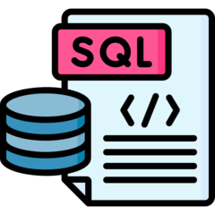
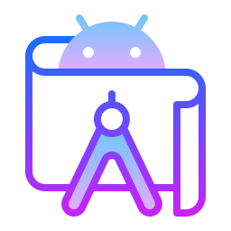

<h1 align="left">Hi!!👋 </h1>

###

My name is Paula Arroyo and I am an Android developer who is in search of new challenges in the world of technology..

###

<h2 align="left">About me</h2>

###

  ✨ In October 2023, I completed the Android Mobile Applications Development bootcamp at Traine, at the Desafío Latam Academy.  
   📚 Currently, I specialize in Android application development.
   🎯 Goals: To establish myself as an Android developer.
   🎲 Interests: Hiking, theater
   📂 For more information, please review <a href="https://paulasalvo.github.io/">My Portfolio</a>

###

<h2 align="left">I code with</h2>

###

  
  
  
  
  
  
  
  

###
